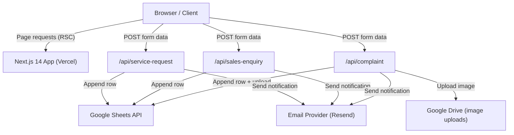
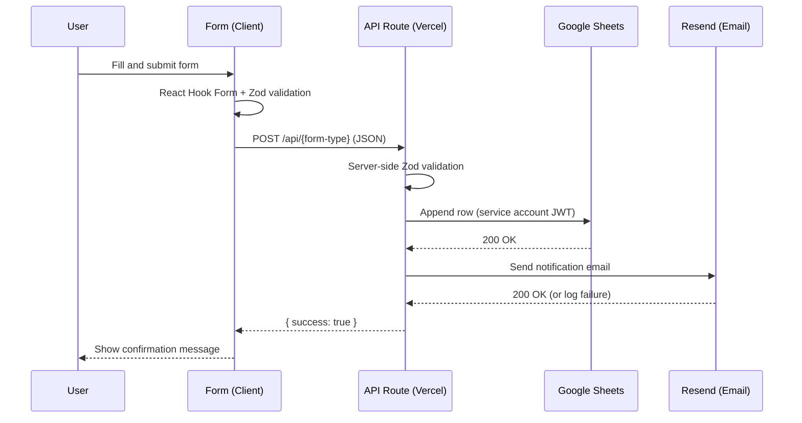

# Design Document: NextGen Service Website

## Overview

NextGen Service is a professional services company offering electrical, plumbing, motor, security, automation, and installation solutions. This website serves as a public-facing marketing site and a lightweight lead/service/complaint management system.

The site is a Next.js 14 App Router application deployed on Vercel. It consists of:
- A homepage with 13 ordered sections
- 12 dynamically-routed service detail pages at `/services/{slug}`
- 3 form submission flows (service request, sales enquiry, complaint)
- 3 Vercel serverless API routes that write to Google Sheets and send email notifications

### Key Design Goals
- Mobile-first, fully responsive at all breakpoints (320px → 1440px)
- All forms auto-populate the service field from page context
- Backend uses Google Sheets as the sole data store (no database required)
- Zero server management — fully serverless on Vercel
- Secrets never exposed to client-side code

---

## Architecture

### High-Level Architecture



### Routing Structure

```
app/
├── page.tsx                          # Homepage (/)
├── services/
│   └── [slug]/
│       └── page.tsx                  # Service detail (/services/{slug})
├── api/
│   ├── service-request/route.ts      # POST /api/service-request
│   ├── sales-enquiry/route.ts        # POST /api/sales-enquiry
│   └── complaint/route.ts            # POST /api/complaint
└── layout.tsx                        # Root layout (Sticky Header + Footer)
```

### Data Flow — Form Submission



---

## Components and Interfaces

### Directory Structure

```
src/
├── app/                              # Next.js App Router pages & API routes
├── components/
│   ├── layout/
│   │   ├── StickyHeader.tsx
│   │   └── Footer.tsx
│   ├── homepage/
│   │   ├── HeroSection.tsx
│   │   ├── QuickActionCards.tsx
│   │   ├── AboutSection.tsx
│   │   ├── ServicesSection.tsx
│   │   ├── WhyChooseUs.tsx
│   │   ├── HowItWorks.tsx
│   │   ├── SalesServiceCTA.tsx
│   │   ├── Testimonials.tsx
│   │   ├── ServiceAreas.tsx
│   │   ├── FAQ.tsx
│   │   └── ContactCTA.tsx
│   ├── service/
│   │   ├── ServiceCard.tsx
│   │   ├── ServiceHero.tsx
│   │   ├── ServiceAbout.tsx
│   │   ├── SalesServiceSection.tsx
│   │   └── ServiceBottomCTA.tsx
│   ├── forms/
│   │   ├── ServiceRequestForm.tsx
│   │   ├── SalesEnquiryForm.tsx
│   │   └── ComplaintForm.tsx
│   └── ui/
│       ├── Button.tsx
│       ├── Input.tsx
│       ├── Select.tsx
│       ├── Textarea.tsx
│       └── FormField.tsx
├── lib/
│   ├── services.ts                   # Service data (slugs, names, descriptions)
│   ├── sheets.ts                     # Google Sheets client helper
│   ├── email.ts                      # Resend email helper
│   └── ids.ts                        # Unique ID generation
├── types/
│   └── index.ts                      # Shared TypeScript types
└── schemas/
    ├── serviceRequest.ts             # Zod schema
    ├── salesEnquiry.ts               # Zod schema
    └── complaint.ts                  # Zod schema
```

### Key Component Interfaces

#### ServiceCard

```typescript
interface ServiceCardProps {
  name: string;
  slug: string;
  description: string;
  imageUrl: string;
  hasSalesEnquiry: boolean;
}
```

#### Service Detail Page (via params)

```typescript
// app/services/[slug]/page.tsx
interface PageProps {
  params: { slug: string };
}
```

#### Form Components — shared prop pattern

All three forms accept an optional `defaultService` prop used for auto-population:

```typescript
interface ServiceRequestFormProps {
  defaultService?: string;
}

interface SalesEnquiryFormProps {
  defaultService?: string;
}

interface ComplaintFormProps {
  defaultService?: string;
}
```

### API Route Contracts

#### POST /api/service-request

Request body (JSON):
```typescript
{
  fullName: string;       // required
  mobile: string;         // required
  email?: string;
  service: string;        // required
  requirementType: string; // required — one of enum values
  location: string;       // required
  preferredDate?: string;
  description: string;    // required
}
```

Response (200):
```typescript
{ success: true; submissionId: string }
```

Response (400):
```typescript
{ success: false; errors: Record<string, string[]> }
```

#### POST /api/sales-enquiry

Request body (JSON):
```typescript
{
  name: string;           // required
  mobile: string;         // required
  email?: string;
  productServiceRequirement?: string;
  quantity?: string;
  location?: string;
  message?: string;
}
```

Response (200):
```typescript
{ success: true; enquiryId: string }
```

#### POST /api/complaint

Request body (multipart/form-data to support image upload):
```typescript
{
  fullName: string;         // required
  mobile: string;           // required
  email?: string;
  serviceProduct: string;   // required
  complaintType: string;    // required — one of enum values
  invoiceReference?: string;
  location: string;         // required
  complaintDescription: string; // required
  image?: File;             // optional, JPEG/PNG/WEBP, max 5MB
}
```

Response (200):
```typescript
{ success: true; complaintId: string }
```

---

## Data Models

### Service Registry

The 12 services are defined as static data in `src/lib/services.ts`. Each entry drives both the homepage service cards and the service detail pages.

```typescript
interface ServiceDefinition {
  slug: string;            // URL-safe kebab-case identifier
  name: string;            // Display name
  shortDescription: string; // Used on homepage Service_Card
  longDescription: string;  // Used on Service_Detail_Page About section
  imageUrl: string;         // Service card / hero image
  hasSales: boolean;        // Whether Sales & Service section is shown
  salesItems?: string[];    // Products/equipment sold (if hasSales)
  serviceItems: string[];   // Services provided
  hasWhatsApp: boolean;     // Pre-filled WhatsApp message toggle
}
```

The 12 services and their slugs:

| Name | Slug | hasSales |
|------|------|----------|
| Electrical Wiring & Renovation | `electrical-wiring-renovation` | false |
| Open Wiring & Concealed Wiring | `open-concealed-wiring` | false |
| Plumbing | `plumbing` | false |
| Irrigation System | `irrigation-system` | false |
| Electrical Fencing | `electrical-fencing` | true |
| Inverter Sales | `inverter-sales` | true |
| Borewell Motor Service & Installation | `borewell-motor` | true |
| Openwell Motor Sales, Service & Installation | `openwell-motor` | true |
| CCTV | `cctv` | true |
| Automation | `automation` | true |
| Appliance Installation | `appliance-installation` | false |
| Fault Fixing | `fault-fixing` | false |

### Google Sheets Schema

#### Sheet 1: Service Requests

| Column | Type | Notes |
|--------|------|-------|
| Submission ID | string | Auto-generated, format: `SR-{YYYYMMDD}-{random6}` |
| Timestamp | datetime | ISO 8601, server time |
| Full Name | string | |
| Mobile Number | string | |
| Email Address | string | May be empty |
| Service | string | |
| Requirement Type | string | Enum: New Installation, Purchase/Sales Enquiry, Repair, Maintenance, Service, Replacement, Other |
| Location | string | |
| Preferred Date | string | May be empty |
| Description | string | |
| Status | string | Initial: "New" |
| Assigned To | string | Initially empty |
| Remarks | string | Initially empty |
| Last Updated | datetime | Initially same as Timestamp |

#### Sheet 2: Sales Enquiries

| Column | Type | Notes |
|--------|------|-------|
| Enquiry ID | string | Auto-generated, format: `SE-{YYYYMMDD}-{random6}` |
| Timestamp | datetime | ISO 8601, server time |
| Customer Name | string | |
| Mobile | string | |
| Email | string | May be empty |
| Category | string | Derived from Product/Service Requirement |
| Product | string | |
| Requirement | string | |
| Quantity | string | May be empty |
| Location | string | May be empty |
| Message | string | May be empty |
| Status | string | Initial: "New"; values: New, Contacted, Quotation Sent, Negotiation, Confirmed, Completed, Cancelled |
| Assigned To | string | Initially empty |
| Remarks | string | Initially empty |
| Last Updated | datetime | Initially same as Timestamp |

#### Sheet 3: Complaints

| Column | Type | Notes |
|--------|------|-------|
| Complaint ID | string | Auto-generated, format: `CP-{YYYYMMDD}-{random6}` |
| Timestamp | datetime | ISO 8601, server time |
| Full Name | string | |
| Mobile Number | string | |
| Email Address | string | May be empty |
| Service/Product | string | |
| Complaint Type | string | Enum: Product Issue, Installation Issue, Service Issue, Technical Issue, Warranty Issue, Other |
| Invoice/Reference Number | string | May be empty |
| Location | string | |
| Complaint Description | string | |
| Image Attachment Link | string | Google Drive URL if image uploaded; otherwise empty |
| Status | string | Initial: "New" |
| Assigned To | string | Initially empty |
| Remarks | string | Initially empty |
| Last Updated | datetime | Initially same as Timestamp |

### Zod Validation Schemas

```typescript
// src/schemas/serviceRequest.ts
export const serviceRequestSchema = z.object({
  fullName: z.string().min(1, "Full name is required"),
  mobile: z.string().min(10, "Valid mobile number required"),
  email: z.string().email().optional().or(z.literal("")),
  service: z.string().min(1, "Service is required"),
  requirementType: z.enum([
    "New Installation", "Purchase/Sales Enquiry", "Repair",
    "Maintenance", "Service", "Replacement", "Other"
  ]),
  location: z.string().min(1, "Location is required"),
  preferredDate: z.string().optional(),
  description: z.string().min(1, "Description is required"),
});

// src/schemas/salesEnquiry.ts
export const salesEnquirySchema = z.object({
  name: z.string().min(1, "Name is required"),
  mobile: z.string().min(10, "Valid mobile number required"),
  email: z.string().email().optional().or(z.literal("")),
  productServiceRequirement: z.string().optional(),
  quantity: z.string().optional(),
  location: z.string().optional(),
  message: z.string().optional(),
});

// src/schemas/complaint.ts
export const complaintSchema = z.object({
  fullName: z.string().min(1, "Full name is required"),
  mobile: z.string().min(10, "Valid mobile number required"),
  email: z.string().email().optional().or(z.literal("")),
  serviceProduct: z.string().min(1, "Service/Product is required"),
  complaintType: z.enum([
    "Product Issue", "Installation Issue", "Service Issue",
    "Technical Issue", "Warranty Issue", "Other"
  ]),
  invoiceReference: z.string().optional(),
  location: z.string().min(1, "Location is required"),
  complaintDescription: z.string().min(1, "Description is required"),
});
```

### Environment Variables

All secrets are stored as Vercel environment variables, never in client-side code:

```
GOOGLE_SERVICE_ACCOUNT_EMAIL=
GOOGLE_PRIVATE_KEY=
GOOGLE_SPREADSHEET_ID=
RESEND_API_KEY=
NOTIFICATION_EMAIL=
NEXT_PUBLIC_COMPANY_PHONE=
NEXT_PUBLIC_WHATSAPP_NUMBER=
```

